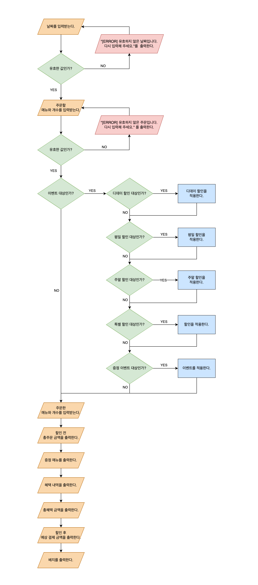

## 설계

## 기능 목록

-[ ] 날짜를 입력받는다.
    - [ ] 유효한 값인가?
      - 공백이 포함되어 있지 않은가?
      - 양의 정수인가?
      - 1이상 31이하의 수 인가?
- [ ] 주문할 메뉴와 개수를 입력받는다.
    - [ ] 유효한 값인가?
        - 공백이 포함되어 있지 않은가?
        - 쉼표로 구분되어 있는가?
        - `{메뉴이름}-{주문수량}`의 형식인가?
        - 메뉴이름이 존재하는 메뉴인가?
        - 주문수량이 양의 정수인가?
- [x] 주문을 생성한다.
  - 주문 개수의 총 합이 20개 이하인가?
  - 음료를 제외한 다른 주문이 존재하는가?
- [ ] 이벤트를 적용한다.
    - 총주문 금액이 10,000원 이상인가?
    - [x] 디데이 할인을 적용한다.
        - 주문일자가 2023.12.01부터 2023.12.25까지 인가?
        - 할인 금액: `1,000 + ((주문 날짜 - 1) * 100)`원
    - [ ] 요일 할인을 적용한다.
        - 평일(일요일 ~ 목요일)에는 디저트 메뉴 1개당 2,023원 할인
        - 주말(금요일 ~ 토요일)에는 메인 메뉴 1개당 2,023원 할인
    - [x] 특별 할인을 적용한다.
        - 이벤트 달력에 별(일요일, 25일)이 있으면 1,000원 할인
    - [ ] 증정 이벤트를 적용한다.
        - 할인 전 총주문 금액이 12만원 이상인가?
        - 샴페인 1개를 증정한다.
- [ ] 혜택 금액에 따라 배지를 부여한다.
    - 5천원 이상: 별
    - 1만원 이상: 트리
    - 2만원 이상: 산타
- [ ] 사용자가 잘못된 값을 입력할 경우 `IllegalArgumentException`를 발생시키고, "[ERROR]"로 시작하는 에러 메시지를 출력 후 그 부분부터 입력을 다시 받는다.